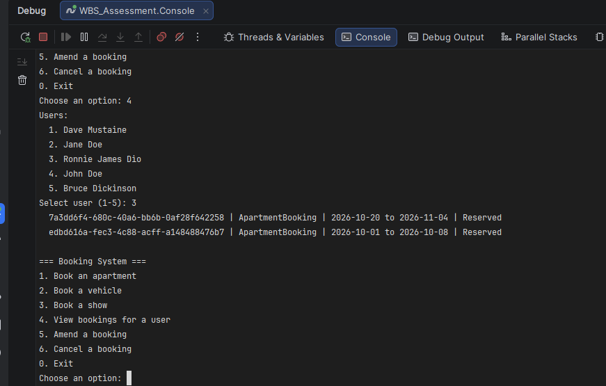
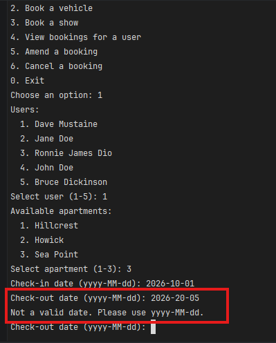
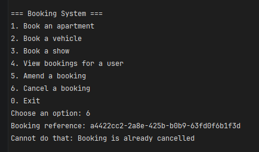
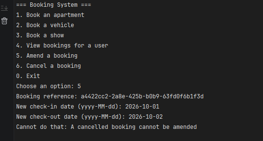
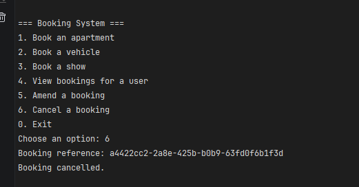
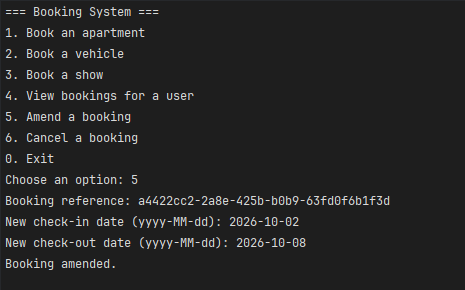
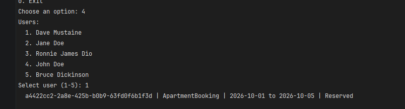
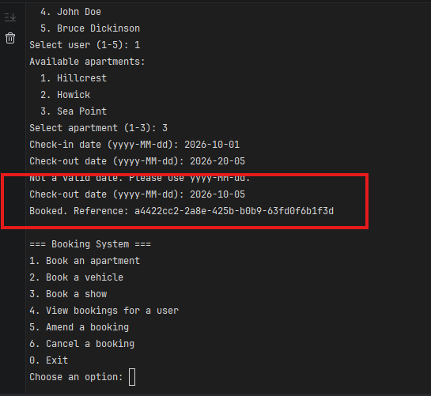

# Booking System

A booking system for items such as apartments, vehicles and
shows, built for the Winterflood technical assessment.

Design decisions, assumptions, rejected alternatives and known limitations are
in [DESIGN.md](DESIGN.md). That document is the main artefact; this one just
covers how to run it.

## Requirements

.NET 10 SDK. No database, no external services.

## Running the console

```bash
dotnet run --project WBS_Assessment.Console
```

A menu-driven front end. Users and items are seeded at startup and selected by
number, so no identifiers need to be typed except booking references, which are
printed when a booking is made.

Dates use `yyyy-MM-dd`.

## Running the API

```bash
dotnet run --project WBS_Assessment.Api
```

Swagger UI is at `/swagger`.

## Structure

| Project | Contains |
|---|---|
| `Core` | Entities and their rules. No dependencies. |
| `Application` | Services, requests, validators, repository interfaces. |
| `Infrastructure` | In-memory repositories and seed data. |
| `Console` | Menu front end. |
| `Api` | HTTP front end. |

## Screenshots of Application running in the console

Below are images showing the various outputs of the console when used

### Console output for Multiple Bookings for a User


### Console output for an Invalid Date


### Console output for Cancelling a Cancelled booking


### Console output for Amending a Cancelled booking


### Console output for a Cancelled booking


### Console output for Amending a booking


### Console output for Bookings for a user


### Console output for Bookings confirmed for a user


## Notes

State is in memory and is lost when the process exits. The two front ends share
one application core and do not reference each other.